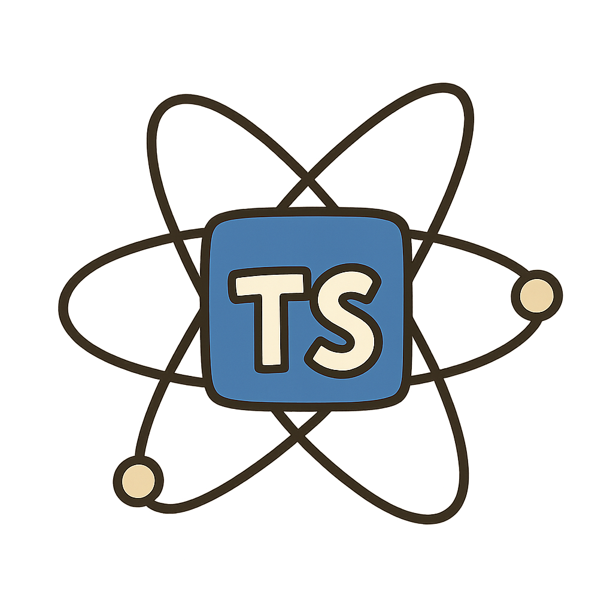

# Electron TypeScript Definitions



This module uses Electron's [JSON API documentation](https://github.com/electron/docs-parser) to produce a TypeScript definition file for the Electron API.

[](https://github.com/electron/typescript-definitions/actions/workflows/test.yml)
[](https://npmjs.org/package/@electron/typescript-definitions)

## Installation

```sh
npm install @electron/typescript-definitions --save
```

## CLI Usage

To generate the definitions

```sh
electron-typescript-definitions --api=path/to/electron/api.json --out-dir=path/to/out/dir
```

Any warnings during the generation can normally be ignored unless it actually throws
an error

## Programmatic Usage

The module exports a function that parses a given API JSON object and returns
an array of lines to create the definition file

```js
import { generateDefinitions } from '@electron/typescript-definitions'

const apiPath = './vendor/electron/docs/api.json'

const definitionLines = generateDefinitions({ electronApi: loadJSON(apiPath) })
// definitionLines will be an string representation of the definition file
```

## License

MIT
